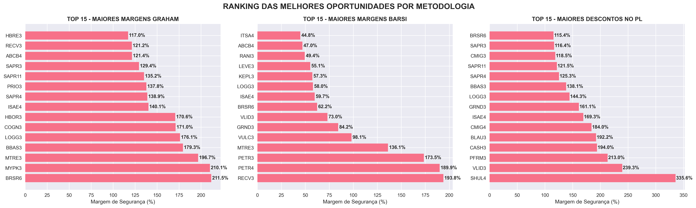
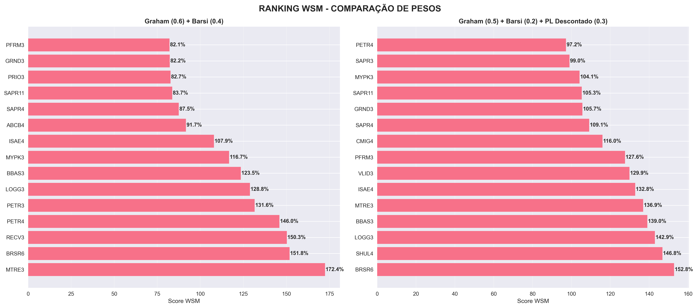
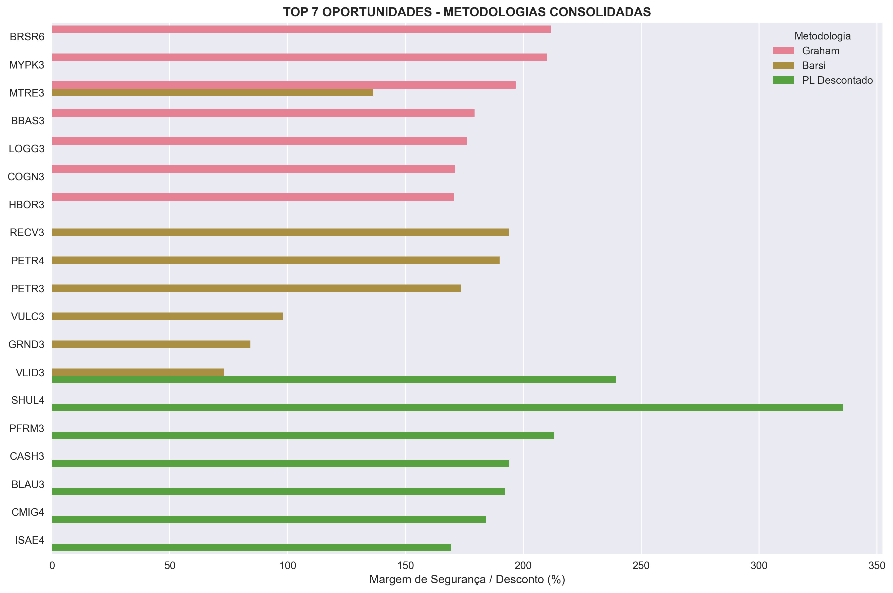

# Analysis of Stock Market Shares

Um analisador fundamentalista de ações brasileiras que utiliza múltiplas metodologias de valuation para identificar oportunidades de investimento.

Este analisador de ações realiza as seguintes tarefas:
- Busca em todas as empresas listadas na bolsa àquelas que (você pode alterar na codificaçaõ os parâmetros de filtro): 
  - Está com PL positivo (não está gerando prejuízo no momento).
  - Possui liquidez maior que R$ 1.000.000,00 diário.
  - Teve crescimento de receita nos últimos 5 anos.
- Gera vários rankings de ações com base em metodologias renomadas na literatura, como Número de Graham e Preço-Teto de Barsi.

## Funcionalidades

### Metodologias Implementadas
- **Graham**: Baseado na metodologia de Benjamin Graham
- **Barsi**: Foco em dividendos e preco teto
- **PL Descontado**: Análise setorial comparativa
- **WSM com todos os indicadores fundamentalistas**

### Análises Geradas
- Preços teto e margens de segurança para cada metodologia
- Rankings WSM (Weighted Sum Model) com diferentes ponderações
- Gráficos comparativos e relatórios visuais
- Filtros personalizáveis por ação

## Instalação

### Pré-requisitos
- Python 3.8+
- pip (gerenciador de pacotes Python)

### Dependências
```pip install pandas numpy matplotlib seaborn fundamentus```

## Estrutura do Projeto
```
AnalysisOfStockMarketShares/
├── run_analysis.sh
├── run_analysis.bat
├── main.py
├── ignorar_acoes.txt
├── data/
│   └── download/
│   └── analises/
│   └── fundamentus.py
├── methodologies/
│   ├── graham.py
│   ├── barsi.py
│   └── pl_descontado.py
│   └── wsm_fundamentalsita.py
└── visualization/
    └── visualizador.py
    └── visualizador_wsm.py
```
## Como Usar

### Execução Rápida
#### Linux/Mac
```./run_analysis.sh```

#### Windows
```run_analysis.bat```

#### Execução Manual
```python main.py```

### Parâmetros Opcionais
#### Atualizar dados (ignorar cache)
```./run_analysis.sh --no-cache```

#### Apenas gerar gráficos (usar dados existentes)
```./run_analysis.sh --apenas-graficos```

## Configuração

### Personalizar Ações Excluídas
Edite o arquivo `ignorar_acoes.txt`:
* Lista de ações para remover da análise
* Use `#` para comentar linhas

```
LIGT3
OIBR3
IRBR3
# MGLU3 - ação comentada (não será removida)
```

## Metodologias

### Graham
- Cálculo: √(22.5 × LPA × VPA)
- Foco: Valor intrínseco e margem de segurança

### Barsi
- Cálculo: (Payout × LPA) / DY_Desejado
- Foco: Dividend yield e pagamento consistente

### PL Descontado
- Cálculo: Comparação do PL atual com media do subsetor
- Foco: Oportunidades setoriais

### Rankings WSM

O sistema gera alguns rankings com base no método de Bejamim Graham, Preço-teto de Barsi, PL descontado e Método de Soma Ponderada (WSM) com ponderações diferentes para cada indicador:

1. WSM: **Graham (60%) + Barsi (40%)**
2. WSM: **Graham (50%) + Barsi (20%) + PL Descontado (30%)**
3. WSM: completo

Para alterar os pesos, edite os arquivos:
```
methodologies/wsm_fundamentalista.py #para WSM completo
criar_graficos_wsm_lado_a_lado em visualization/visualizador.py #Demais WSM
```

## Saídas

### Arquivos Gerados
- data/download/ativos_DD_MM_YYYY.csv: Dataset completo com analises
- data/analises/ranking_metodologias.png: Graficos individuais
- data/analises/ranking_wsm_pesos.png: Comparação WSM
- data/analises/ranking_consolidado.png: Visao consolidada
- data/analises/wsm_completo_*.png: Vários gráficos para análise com base nos pesos oferecidos

### Console
- Ranking das melhores oportunidades por metodologia
- Estatisticas de margens positivas
- Ações removidas por filtro

### Considerações
Algumas empresas podem não aparecer nos rankings gerados pela metodologia WSM devido a características específicas de seus setores que impedem o cálculo adequado das médias ponderadas. Por exemplo: setor bancário e seguradoras. 

Para visualizar todas as empresas que não foram consideradas no ranking WSM:
- Consulte o arquivo: `data/analises/resultados_wsm_completo.csv`
- Verifique a coluna Score_WSM - valores nulos ou ausentes indicam empresas excluídas da análise
- Analise o campo Subsetor para identificar padrões de exclusão por segmento

## Exemplos de Gráficos

### Ranking por Metodologia


### Comparação WSM - Pesos Diferentes  


### Ranking Consolidado


Diversos outros gráficos são gerados e você pode verificar exemplos no diretório `data/analises`

## Personalização

### Adicionar Novas Metodologias
1. Crie nova classe em `methodologies/`
2. Importe no `main.py`
3. Adicione na função `adicionar_analises`

## Troubleshooting

### Erro de Dependências
```pip install --upgrade pandas numpy matplotlib seaborn fundamentus```

### Erro de Permissão (Linux)
```chmod +x run_analysis.sh```

### Arquivo de Exclusão Não Encontrado
- Certifique-se que `ignorar_acoes.txt` está na raíz do projeto

## Refinamento da Análise
- **Personalize seus critérios:** Ignore empresas que não se alinham com seu perfil de investimento, estratégia ou tolerância a risco
- **Lista de exclusão:** Utilize o arquivo ignorar_acoes.txt para excluir empresas que não deseja analisar, como:
  - Empresas recentes na bolsa (IPO recente)
  - Setores que não compreende ou não confia 
  - Companhias com histórico problemático ou governance questionável 
  - Ativos com liquidez insuficiente para seu portfólio

## Validação dos Resultados
- **Os rankings são pontos de partida:** Utilize as listas geradas como screening inicial, não como decisão final
- **Análise individual obrigatória:** Sempre investigue cada empresa do ranking antes de qualquer consideração de investimento
- **Contexto é fundamental:** Considere fatores macroeconômicos, tendências setoriais e eventos específicos da empresa

## Licença
- Projeto para fins educacionais e de pesquisa.

